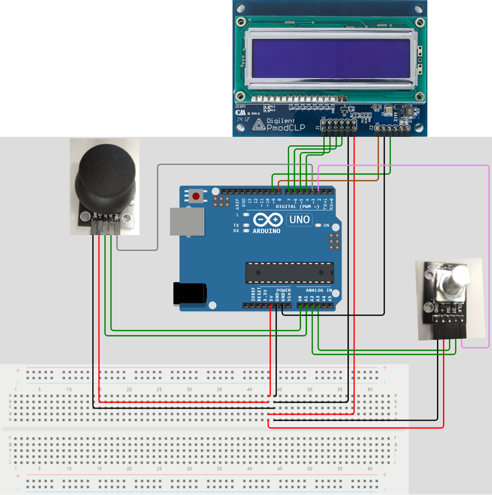

# Project 1

Application of analog joy-stick (2 ADC channels, 1 push button), rotary encoder, and Digilent PmodCLP LCD module.

## Instructions

The goal of the project is cooperation in pairs, further study of the topic, design of own solutions, implementation, creation of project documentation and presentation of results. The division of roles and tasks within the team is up to their members.

* Students work on a project in the labs during the 10th and 11th weeks of the semester.

* Through the BUT e-learning, students submit a link to the GitHub repository, which contains the complete project in PlatfomIO and a descriptive README file. The submission deadline is the day before the next laboratory, i.e. in 2 weeks.

* The source code for the AVR must be written in C and/or Assembly and must be implementable on Arduino Uno board using toolchains from the semester. No other development tools are allowed.

### Team members

* Member 1 (responsible for xxx)
* Member 2 (responsible for xxx)

## GitHub repository structure

   ```c
   project_1           // PlatfomIO project
   ├── include         // Included files
   │   └── timer.h
   ├── lib             //Libraries
   │   ├── gpio
   │   │   ├── gpio.c
   │   │   └── gpio.h
   │   ├── lcd
   │   │   ├── lcd.c
   │   │   ├── lcd.h
   │   |   └── lcd_definitions.h
   │   └── uart
   │       ├── uart.c
   │       └── uart.h
   ├── src                // Source file
   │   └── main.c
   ├── test
   │   └── README.md    // Report of this project
   └── platformio.ini   // Project Configuration File
         
   ```

## Hardware description

#### Schematic of the implementation:



| **Joystick pin** | **Description** | **Arduino uno pin** |
| :-: | :-: | :-: |
| GND | Power Supply Ground | GND |
| +5V | Positive Power Supply | +5V |
| VRx | ADC channel | A1 (PC1) |
| VRy | ADC channel | A0 (PC0) |
| SW | Push Button | D3 (PD3) |

| **Rotary encoder pin** | **Description** | **Arduino uno pin** |
| :-: | :-: | :-: |
| CLK | Digital Input | D2 (PD2) |
| DT | Analog Input | A2 (PC2) |
| SW | Analog Input (Push Button) | A3 (PC3) |
| + | Positive Power Supply | +5V |
| GND | Power Supply Ground | GND |

| **Digilent PmodCLP LCD pin** | **Signal** | **Description** | **Arduino uno pin** |
| :-: | :-: | :-: | :-: |
| 7 (J1 - Bottom Half) | DB4 | Data Bit 4 | D4 (PD4) |
| 8 (J1 - Bottom Half) | DB5 | Data Bit 5 | D5 (PD5) |
| 9 (J1 - Bottom Half) | DB6 | Data Bit 6 | D6 (PD6) |
| 10 (J1 - Bottom Half) | DB7 | Data Bit 7 | D7 (PD7) |
| 11 (J1 - Bottom Half) | GND | Power Supply Ground | GND |
| 12 (J1 - Bottom Half) | VCC | Positive Power Supply | +5V |
| 1 (J2) | RS | Register Select | D8 (PB0) |
| 2 (J2) | R/W | Read/Write Signal | GND |
| 3 (J2) | E | Read/Write Enable | D9 (PB1) |


## Software description

#### Flowcharts of the algorithms:

Write descriptive text of your libraries and source files. Put direct links to these files in `src` or `lib` folders.

## Video

A short video with the practical implementation example of this project is available right [here](https://www.youtube.com/watch?v=BsZNbVuyCBM).

## References

1. [Pmod CLP Reference Manual](https://digilent.com/reference/pmod/pmodclp/reference-manual?redirect=1)
2. https://github.com/tomas-fryza/digital-electronics-2/tree/master/labs/02-gpio
3. https://github.com/tomas-fryza/digital-electronics-2/tree/master/labs/03-interrupts
4. https://github.com/tomas-fryza/digital-electronics-2/tree/master/labs/04-lcd
5. https://github.com/tomas-fryza/digital-electronics-2/tree/master/labs/05-adc
6. https://github.com/tomas-fryza/digital-electronics-2/tree/master/labs/06-uart
