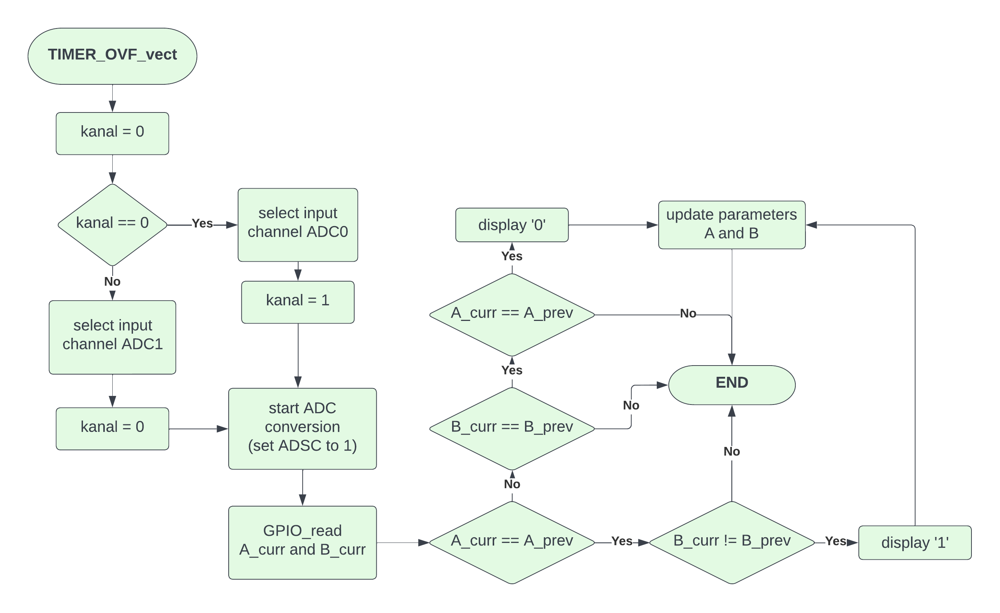
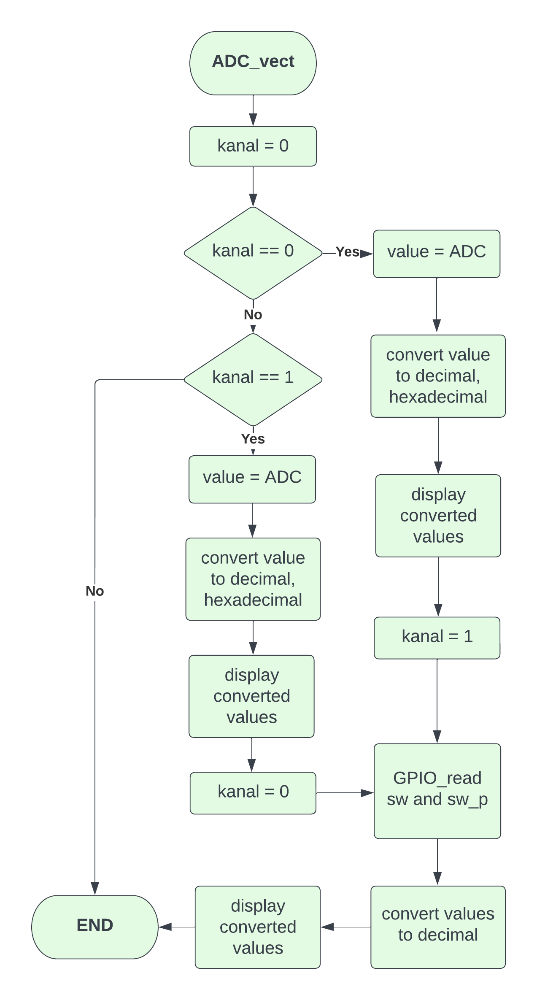

# Project 1

Application of analog joy-stick (2 ADC channels, 1 push button), rotary encoder, and Digilent PmodCLP LCD module.

### Team members

* Josef Kaplan (responsible for code, documentation, schematic)
* Hajnalka Csiba (responsible for code, github repository, flowcharts)

## GitHub repository structure

   ```c
   project_1           // PlatfomIO project
   ├── include         // Included files
   │   └── timer.h
   ├── lib             //Libraries
   │   ├── gpio
   │   │   ├── gpio.c
   │   │   └── gpio.h
   │   ├── lcd
   │   │   ├── lcd.c
   │   │   ├── lcd.h
   │   |   └── lcd_definitions.h
   │   └── uart
   │       ├── uart.c
   │       └── uart.h
   ├── src              // Source file
   │   └── main.c
   ├── test
   │   └── README.md    // Report of this project
   └── platformio.ini   // Project Configuration File
         
   ```

## Hardware description

#### Schematic of the implementation:


| **Joystick pin** | **Description** | **Arduino uno pin** |
| :-: | :-: | :-: |
| GND | Power Supply Ground | GND |
| +5V | Positive Power Supply | +5V |
| VRx | ADC channel | A1 (PC1) |
| VRy | ADC channel | A0 (PC0) |
| SW | Push Button | D3 (PD3) |

| **Rotary encoder pin** | **Description** | **Arduino uno pin** |
| :-: | :-: | :-: |
| CLK | Digital Input | D2 (PD2) |
| DT | Analog Input | A2 (PC2) |
| SW | Analog Input (Push Button) | A3 (PC3) |
| + | Positive Power Supply | +5V |
| GND | Power Supply Ground | GND |

| **Digilent PmodCLP LCD pin** | **Signal** | **Description** | **Arduino uno pin** |
| :-: | :-: | :-: | :-: |
| 7 (J1 - Bottom Half) | DB4 | Data Bit 4 | D4 (PD4) |
| 8 (J1 - Bottom Half) | DB5 | Data Bit 5 | D5 (PD5) |
| 9 (J1 - Bottom Half) | DB6 | Data Bit 6 | D6 (PD6) |
| 10 (J1 - Bottom Half) | DB7 | Data Bit 7 | D7 (PD7) |
| 11 (J1 - Bottom Half) | GND | Power Supply Ground | GND |
| 12 (J1 - Bottom Half) | VCC | Positive Power Supply | +5V |
| 1 (J2) | RS | Register Select | D8 (PB0) |
| 2 (J2) | R/W | Read/Write Signal | GND |
| 3 (J2) | E | Read/Write Enable | D9 (PB1) |


## Software description

To write the source file, we used the code from lab exercise 5 (lab5-adc) as a template and extended it. The libraries that we used in this project were copied from previous labs.

#### Source file

* [main.c](https://github.com/xcsiba01/digital-electronics2/blob/main/project_1/src/main.c)
* In the `main.c` code we used two algorithms: `ADC_vect` and `TIMER1_OVF_vect`. The flowcharts of the algorihms are as follows:





* We used single conversion mode and started the AD conversion every 33 ms by Timer/Counter1 overflow.
* When the analog to digital conversion is finished, the value of the deviation value (0-1023) of the joystick is read and displayed in decimal at the LCD display. Then this value is also displayed in hexadecimal.
* The values are converted into a string with function `itoa`.

| **Return** | **Function name** | **Function parameters** | **Description** |
| :-: | :-- | :-- | :-- |
| `char *` | `itoa` | ` int value, char * str, int base ` | Convert int data type to string data type |

#### Library `gpio`

* [gpio.c](https://github.com/xcsiba01/digital-electronics2/blob/main/project_1/lib/gpio/gpio.c)
* [gpio.h](https://github.com/xcsiba01/digital-electronics2/blob/main/project_1/lib/gpio/gpio.h)
* GPIO library functions used in this project:

| **Return** | **Function name** | **Function parameters** | **Description** |
| :-: | :-- | :-- | :-- |
| `void` | `GPIO_mode_input_pullup` | `volatile uint8_t *reg, uint8_t pin` | Configure one input pin and enable pull-up resistor |
| `uint8_t` | `GPIO_read` | `volatile uint8_t *reg, uint8_t pin` | Read a value from input pin |

#### Library `lcd`

* [lcd.c](https://github.com/xcsiba01/digital-electronics2/blob/main/project_1/lib/lcd/lcd.c)
* [lcd.h](https://github.com/xcsiba01/digital-electronics2/blob/main/project_1/lib/lcd/lcd.h)
* [lcd_definitions.h](https://github.com/xcsiba01/digital-electronics2/blob/main/project_1/lib/lcd/lcd_definitions.h)
* LCD library functions used in this project:

| **Return** | **Function name** | **Function parameters** | **Description** |
| :-: | :-- | :-- | :-- |
| `void` | `lcd_init` | `uint8_t dispAttr` | Initialize display and select type of cursor |
| `void` | `lcd_gotoxy` | `uint8_t x, uint8_t y` | Set cursor to specified position |
| `void` | `lcd_puts` | `const char *s` | Display string without auto linefeed |

#### Library `uart`

* [uart.c](https://github.com/xcsiba01/digital-electronics2/blob/main/project_1/lib/uart/uart.c)
* [uart.h](https://github.com/xcsiba01/digital-electronics2/blob/main/project_1/lib/uart/uart.h)
* UART library functions used in this project:

| **Return** | **Function name** | **Function parameters** | **Description** |
| :-: | :-- | :-- | :-- |
| `void` | `uart_puts` | `const char *s` | Transmit string to UART |

#### Library `timer.h`

* [timer.h](https://github.com/xcsiba01/digital-electronics2/blob/main/project_1/include/timer.h)
* The library contains macros for controlling the timer modules.

## Video

A short video with the practical implementation example of this project is available right [here](https://www.youtube.com/watch?v=BsZNbVuyCBM).

## References

1. [PmodCLP Reference Manual](https://digilent.com/reference/pmod/pmodclp/reference-manual?redirect=1)
2. [Arduino Uno Pinout](https://docs.arduino.cc/retired/boards/arduino-uno-rev3-with-long-pins)
3. [Rotary Encoder](https://howtomechatronics.com/tutorials/arduino/rotary-encoder-works-use-arduino/)
4. https://github.com/tomas-fryza/digital-electronics-2/tree/master/labs/02-gpio
5. https://github.com/tomas-fryza/digital-electronics-2/tree/master/labs/03-interrupts
6. https://github.com/tomas-fryza/digital-electronics-2/tree/master/labs/04-lcd
7. https://github.com/tomas-fryza/digital-electronics-2/tree/master/labs/05-adc
8. https://github.com/tomas-fryza/digital-electronics-2/tree/master/labs/06-uart
