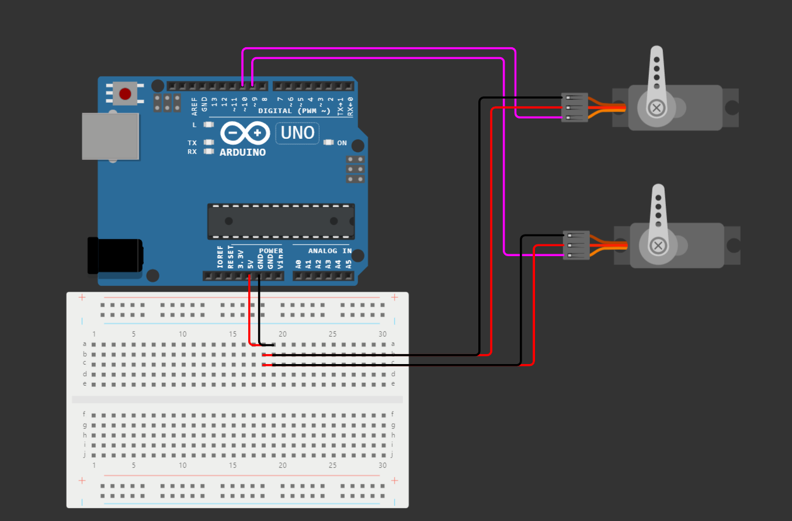

# Project 1

Precise generation of several PWM channels. Application of two (or more) Servo motors SG90.

### Team members

* Josef Kaplan (responsible for code, documentation)
* Hajnalka Csiba (responsible for code, github repository, schematic)

### Table of contents

* [GitHub repository structure](#github)
* [Hardware description](#hardware)
* [Software description](#software)
* [Video](#video)
* [References](#references)

<a name="github"></a>

## GitHub repository structure

   ```c
   project_2.0            // PlatfomIO project
   ├── include         
   ├── lib             
   ├── src              // Source file
   │   └── main.c
   ├── test
   │   └── README.md    // Report of this project
   └── platformio.ini   // Project Configuration File
         
   ```
<a name="hardware"></a>

## Hardware description

#### Schematic of the implementation:



| **Servo motor 1** | **Description** | **Arduino uno pin** |
| :-: | :-: | :-: |
| GND | Power Supply Ground | GND |
| VCC | Positive Power Supply | +5V |
| PWM | PWM signals | ~D9 (PB1) |

| **Servo motor 2** | **Description** | **Arduino uno pin** |
| :-: | :-: | :-: |
| GND | Power Supply Ground | GND |
| VCC | Positive Power Supply | +5V |
| PWM | PWM signals | ~D10 (PB2) |

<a name="software"></a>

## Software description

#### Source file

* [main.c]()
* In the `main.c` code ...

<a name="video"></a>

## Video

A short video with the practical implementation example of this project is available right [here]().

<a name="references"></a>

## References

1. [PmodCLP Reference Manual](https://digilent.com/reference/pmod/pmodclp/reference-manual?redirect=1)
2. [Arduino Uno Pinout](https://docs.arduino.cc/retired/boards/arduino-uno-rev3-with-long-pins)
3. [Rotary Encoder](https://howtomechatronics.com/tutorials/arduino/rotary-encoder-works-use-arduino/)
4. https://github.com/tomas-fryza/digital-electronics-2/tree/master/labs/02-gpio
5. https://github.com/tomas-fryza/digital-electronics-2/tree/master/labs/03-interrupts
6. https://github.com/tomas-fryza/digital-electronics-2/tree/master/labs/04-lcd
7. https://github.com/tomas-fryza/digital-electronics-2/tree/master/labs/05-adc
8. https://github.com/tomas-fryza/digital-electronics-2/tree/master/labs/06-uart
