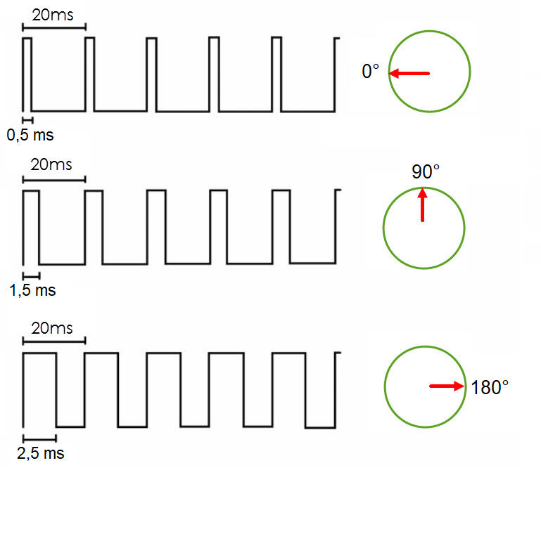

# Project 1

Precise generation of several PWM channels. Application of two (or more) Servo motors SG90.

### Team members

* Josef Kaplan (responsible for code, documentation)
* Hajnalka Csiba (responsible for code, github repository, schematic)

### Table of contents

* [GitHub repository structure](#github)
* [Hardware description](#hardware)
* [Software description](#software)
* [Video](#video)
* [References](#references)

<a name="github"></a>

## GitHub repository structure

   ```c
   project_2.0            // PlatfomIO project
   ├── include         
   ├── lib             
   ├── src              // Source file
   │   └── main.c
   ├── test
   │   └── README.md    // Report of this project
   └── platformio.ini   // Project Configuration File
         
   ```
<a name="hardware"></a>

## Hardware description

#### Schematic of the implementation:


| **Servo motor 1** | **Description** | **Arduino uno pin** |
| :-: | :-: | :-: |
| GND | Power Supply Ground | GND |
| VCC | Positive Power Supply | +5V |
| PWM | PWM Signals | ~D9 (PB1) |

| **Servo motor 2** | **Description** | **Arduino uno pin** |
| :-: | :-: | :-: |
| GND | Power Supply Ground | GND |
| VCC | Positive Power Supply | +5V |
| PWM | PWM Signals | ~D10 (PB2) |

<a name="software"></a>

## Software description

#### Source file

* [main.c](https://github.com/xcsiba01/digital-electronics2/blob/main/project_2.0/src/main.c)
* In the `main.c` code we included the `Arduino.h` library.
* At the beginning of the code the following variables are defined:

| **Variable** | **Value** | **Description** |
| :-: | :-: | :-: |
| `static int start` | `500` | start PWM pulse width, 0.5 ms corresponds to the 0° of rotation |
| `static int end` | `1500` or `2500` | final PWM pulse width, 1.5 ms (resp. 2.5 ms) corresponds to the 0° (resp. 180°) of rotation |
| `static int step` | `10` | step value used in the `for` cycle |
| `static int counter` | `0` | counter, for changing the pulse widths in the infinite loop |

* The Arduino Uno pins 9 and 10 are defined as output pins.
* By using registers TCCR1A and TCCR1B we chose the phase correct PWM mode. In this mode Timer 1 counts from a BOTTOM value to a TOP value.
* TCCR1A – Timer/Counter1 Control Register A:

| **Bit** | 7 | 6 | 5 | 4 | 3 | 2 | 1 | 0 |
| :-: | :-: | :-: | :-: | :-: | :-: | :-: | :-: | :-: |
| **(0x80)** | COM1A1 | COM1A0 | COM1B1 | COM1B0 | - | - | WGM11 | WGM10 |
| **Read/Write** | R/W | R/W | R/W | R/W | R | R | R/W | R/W |
| **Value** | 1 | 0 | 1 | 0 | 0 | 0 | 1 | 0 |
| **Description** | controls pin 9 | controls pin 9 | controls pin 10 | controls pin 10 | - | - | Waveform Generation Mode | Waveform Generation Mode |

* TCCR1B – Timer/Counter1 Control Register B:

| **Bit** | 7 | 6 | 5 | 4 | 3 | 2 | 1 | 0 |
| :-: | :-: | :-: | :-: | :-: | :-: | :-: | :-: | :-: |
| **(0x81)** | ICNC1 | ICES1 | - | WGM13 | WGM12 | CS12 | CS11 | CS10 |
| **Read/Write** | R/W | R/W | R | R/W | R/W | R/W | R/W | R/W |
| **Value** | 0 | 0 | 0 | 1 | 0 | 0 | 1 | 0 |
| **Description** | Input Capture Noise Canceler |  Input Capture Edge Select | Reserved bit | Waveform Generation Mode | Waveform Generation Mode | Clock Select | Clock Select | Clock Select |

* The prescaler (= 8) is defined by bits CS12, CS11 and CS10. 
* TOP is declared by ICR1, which sets the frequency/time period (50 Hz/20 ms).
* OCR1A and OCR1B registers are controlling the duty cycles of the PWM signals for pin 9 (OCR1A) and pin 10 (OCR1B).
* In the infinite loop `while` the counter counts from minimal pulse width to maximum pulse width then vice versa. 
* The two servo motors rotate simultaneously describing a 180° angle.


<a name="video"></a>

## Video

A short video with the practical implementation example of this project is available right [here]().

<a name="references"></a>

## References

1. [Arduino Uno Pinout](https://docs.arduino.cc/retired/boards/arduino-uno-rev3-with-long-pins)
2. [Servo Motor Basics with Arduino](https://docs.arduino.cc/learn/electronics/servo-motors)
3. [SG90 Datasheet](https://datasheetspdf.com/pdf-file/791970/TowerPro/SG90/1)
4. https://www.eprojectszone.com/how-to-control-a-servomotor-without-arduino-servo-library/

